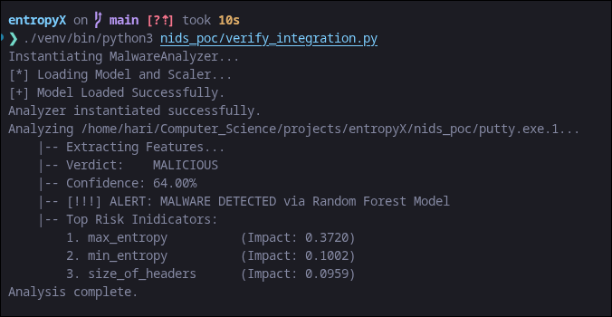
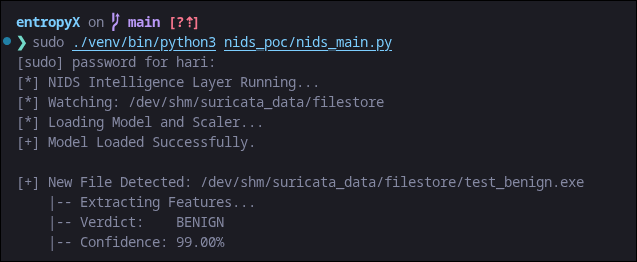
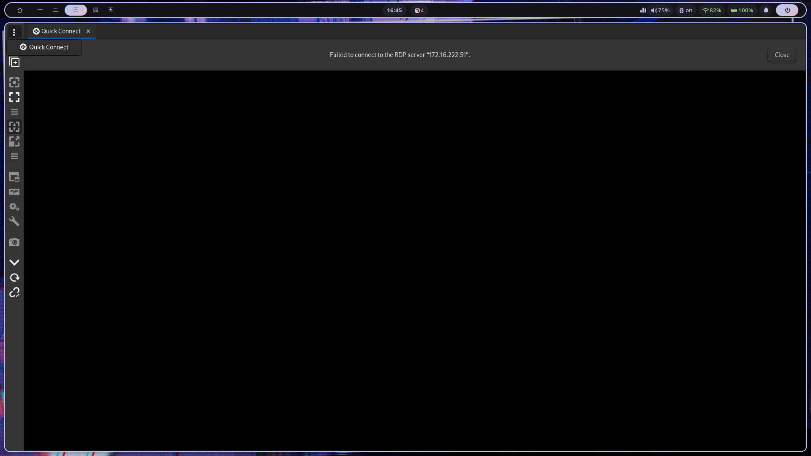
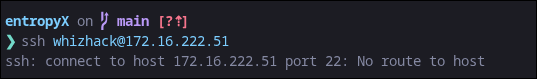

# Project Status: ML-Powered Ransomware Detection Pipeline (v1.0-PoC)

**Date:** February 13, 2026

**Project Goal:** Real-time Ransomware detection via Deep Packet Inspection (DPI) and ML Inference.

---

## 1. Executive Summary

The system successfully monitors a network-linked directory, extracts PE-specific features (Entropy, Headers, Section Analysis), and classifies payloads as **Malicious** or **Benign** in real-time.

---

## 2. Current Architecture

The Proof of Concept (PoC) utilizes a three-tier architecture:

1. **Sensor Layer:** Suricata 7.0 running in Docker (Host Mode) utilizing PCAP capture on `lo`.
2. **Storage Layer:** High-speed RAM Disk (`/dev/shm`) acting as a zero-latency bridge between the sensor and the model.
3. **Inference Layer:** Custom Python 3.14 watcher utilizing `watchdog`, features from `extractor.py`, and a pre-trained **Random Forest** model (`malware_rf_v1`) for real-time classification.

---

## 3. Technical Accomplishments

- **Zero-Latency Bridge:** Established a RAM-disk based file-store pipeline to avoid SSD bottlenecks during high-frequency attacks.
- **Feature Extraction Engine:** Integrated `extractor.py` to extract comprehensive PE features, including Section Entropy, Header sizes, and structural ratios.
- **ML Integration:** Replaced simple entropy heuristics with a trained **Random Forest Classifier**.
- **Validated Results:**
  - **Execution:** Model successfully loads features, scales input, and provides probabilistic verdicts.
  - **Malicious Test:** Sample malware correctly flagged as **MALICIOUS** with Confidence score and top feature drivers (e.g., `max_entropy`).
  - **Benign Test:** Standard executables correctly identified as **BENIGN**.

Malicious Result:

Benign Result:

---

## 4. Requirements for Phase 2 (Live Network Traffic)

To transition from Simulation to **Live Production Traffic**, I request the following environment support:

1. **Dedicated VM Environment Restoration:**
   Testing is currently blocked due to connectivity issues with the Windows VM instance. Both remote desktop (Remmina) and SSH access are currently unreachable. Resolving this accessibility issue is critical for proceeding with live network validation.

   _Reference Images:_
   
   

2. **DPI Engine Access:**
   To ensure seamless model integration for the final release, access to the DPI Engine architecture would be highly beneficial. Early exploration of the integration points will help refine the deliverables and ensure the model operates effectively within the wider system.

---

## 5. Next Steps

- [ ] Implement a CSV-based "Decision Log" for the Inference engine to track False Positive Rates (FPR).
- [x] Integrate trained ML Model (Random Forest) for weighted feature classification.
- [ ] Train the model with better dataset
- [ ] Deploy it on TRACE architecture alongside the DPI Engine

---
