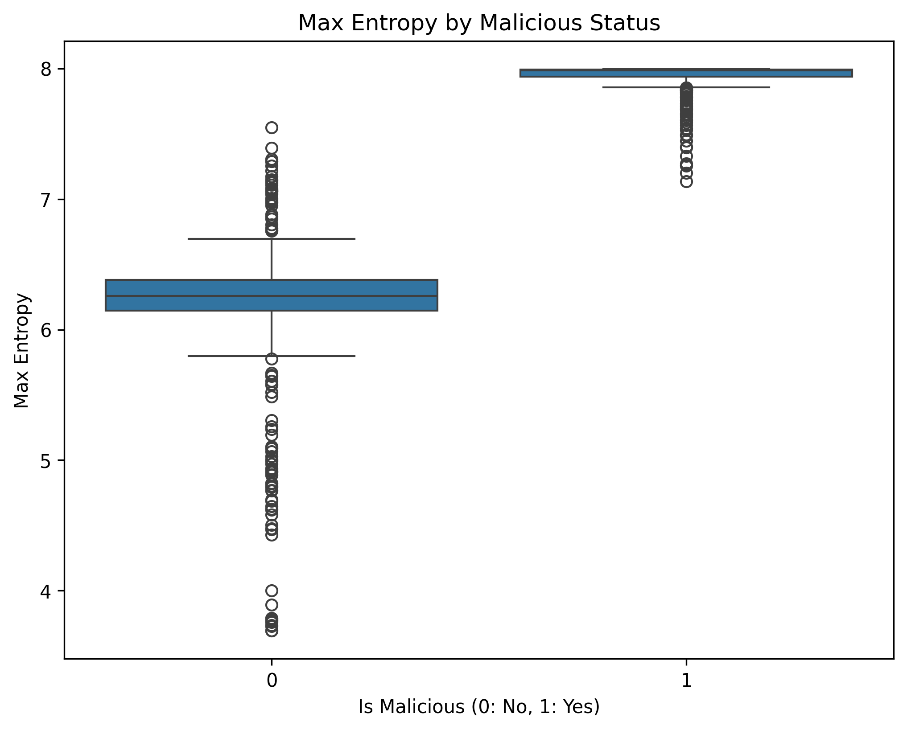

# EntropyX: PE Feature Extractor for Malware Classification

> **Project Goal:** Build a robust feature extractor for Malware Classification using Random Forest.  
> **Last Updated:** February 2026

---

## Table of Contents

1. [Project Overview](#1-project-overview)
2. [The Problem & Why Entropy Matters](#2-the-problem--why-entropy-matters)
3. [Development Timeline (Git Commit History)](#3-development-timeline-git-commit-history)
4. [Key Technical Decisions](#4-key-technical-decisions)
5. [Pythonic Implementation Details](#5-pythonic-implementation-details)
6. [Architecture & Code Organization](#6-architecture--code-organization)
7. [Model Training & Results](#7-model-training--results)
8. [Future Improvements](#8-future-improvements)

---

## 1. Project Overview

This project extracts features from Portable Executable (PE) files to train a machine learning model that distinguishes **malware** from **benign** executables. The primary signal is **Shannon Entropy**, which measures randomness in data—encrypted or compressed malware payloads have distinctively high entropy.

### Key Files

| File                         | Purpose                                          |
| ---------------------------- | ------------------------------------------------ |
| `extractor.py`               | Main feature extraction logic                    |
| `builder.py`                 | Batch processes PE files → generates dataset.csv |
| `trainer.py`                 | Trains Random Forest model & evaluates results   |
| `generate_custom_malware.sh` | Creates synthetic high-entropy malware samples   |
| `generate_benign.sh`         | Retrieves legitimate Windows system files        |
| `data/malicious/`            | Training samples (custom loaders + SGN encoded)  |
| `data/benign/`               | Legitimate Windows executables                   |

---

## 2. The Problem & Why Entropy Matters

### Initial Hypothesis (Flawed)

> "Simply calculate the entropy of the whole file to detect malware."

### Why It Failed

| Issue                 | Explanation                                                                                                                      |
| --------------------- | -------------------------------------------------------------------------------------------------------------------------------- |
| **False Positives**   | Benign installers (e.g., `.msi`, compressed apps) also have high entropy                                                         |
| **Missed Detections** | Malware hides encrypted payloads in _small sections_, while the rest is null padding—averaging the whole file dilutes the signal |
| **Example**           | `custom_loader.exe` showed only **1.4 entropy** at file-level, but **7.13 entropy** in its `.data` section                       |

### The Solution

**Section-Aware Analysis** — Analyze each PE section individually, then summarize with statistics.

---

## 3. Development Timeline (Git Commit History)

This section maps each commit to the problem it solved and the performance/accuracy improvement gained.

### Commit 1: `1fbe40a` — Scripts to generate or retrieve training data

**What:** Created shell scripts to automate dataset generation.  
**Why:** Manual data collection doesn't scale. Needed 600+ samples for balanced training.

---

### Commit 2: `c843e16` — Wrote the function to calculate Shannon entropy

**What:** First implementation of `shanon_helper()`.

```python
# BEFORE (Naive approach)
probabilities = {byte: count / total_bytes for byte, count in counter.items()}
for prob in probabilities.values():
    entropy += prob * math.log2(prob)
entropy = 0.0 - entropy  # Negation at the end
```

**Problem:** Created an intermediate dictionary (`probabilities`) unnecessarily—wasted memory on large files.

---

### Commit 3: `7b2fe64` — Optimized the `shanon_helper` function

**What:** Eliminated the intermediate dictionary and added safety checks.

```python
# AFTER (Optimized)
for count in counter.values():
    prob = count / total_bytes
    entropy -= prob * math.log2(prob)  # Direct subtraction
```

| Improvement         | Before                            | After                        |
| ------------------- | --------------------------------- | ---------------------------- |
| Memory allocation   | Dict of 256 entries               | None (direct iteration)      |
| Empty file handling | ❌ Division by zero crash         | ✅ Returns 0.0 safely        |
| Readability         | Two-step (calculate, then negate) | One-step (subtract directly) |

---

### Commit 4: `1b71e0c` — Updated `extractor.py` and `generate_custom_malware.sh`

**What:** Two critical changes.

#### Change A: Refactored `shanon_helper` to accept binary data (not file path)

```python
# BEFORE: Tightly coupled to file I/O
def shanon_helper(filepath):
    with open(filepath, 'rb') as file:
        file_bytes = file.read()

# AFTER: Pure function, accepts any bytes
def shanon_helper(binary_data):
    counter.update(binary_data)
```

| Improvement     | Impact                                                            |
| --------------- | ----------------------------------------------------------------- |
| **Testability** | Can now unit test with `b'\x00\xff'` without creating files       |
| **Reusability** | Same function works for PE sections, raw buffers, network streams |
| **Performance** | Avoids redundant file opens when PE is already parsed             |

#### Change B: Fixed the "Hex Trap" in malware generation

**The Bug:** Generating payloads as hex strings (`A-F0-9`) limited entropy to **~4.0 bits**.

> Hex uses only 16 characters (4 bits of entropy max), not 256 possible byte values (8 bits).

```bash
# BEFORE (Limited entropy)
PAYLOAD_DATA=$(head /dev/urandom | tr -dc A-F0-9 | head -c $PAYLOAD_SIZE)
const char encrypted_payload[] = "$PAYLOAD_DATA";  # Stored as ASCII string

# AFTER (True randomness)
PAYLOAD_ARRAY=$(head -c $PAYLOAD_SIZE /dev/urandom | od -An -v -t x1 | ...)
unsigned char encrypted_payload[] = { $PAYLOAD_ARRAY };  # Stored as raw bytes
```

| Metric                  | Before (Hex String)         | After (Raw Bytes)                    |
| ----------------------- | --------------------------- | ------------------------------------ |
| Max theoretical entropy | 4.0 bits                    | 8.0 bits                             |
| Actual measured entropy | ~3.8 bits                   | ~7.99 bits                           |
| Realism                 | ❌ No real malware uses hex | ✅ Mimics AES/RC4 encrypted payloads |

---

### Commit 5: `a1dd06c` — Orchestrator v1 and `get_structural_features`

**What:** Introduced the Orchestrator pattern and added structural features.

#### New Features Extracted

| Feature                      | Why It Matters                                           |
| ---------------------------- | -------------------------------------------------------- |
| `num_sections`               | Packed malware often has unusual section counts          |
| `virtual_size_ratio`         | Ratio > 1.0 indicates runtime unpacking (malware signal) |
| `raw_size` vs `virtual_size` | Discrepancy reveals hidden payloads                      |

#### Architectural Change: Orchestrator Pattern

```python
def extract_all_features(filepath) -> dict:  # Orchestrator
    pe = pefile.PE(filepath)
    features = {}
    features.update(get_entropy_features(pe))      # Worker 1
    features.update(get_structural_features(pe))   # Worker 2
    pe.close()
    return features
```

| Benefit                   | Explanation                                                |
| ------------------------- | ---------------------------------------------------------- |
| **Extensibility**         | Add `get_import_features()` without touching entropy logic |
| **Single Responsibility** | Each worker does one thing well                            |
| **Resource Safety**       | `pe.close()` in one place (now in `finally` block)         |

---

### Commit 6: `builder.py` — Dataset CSV Generator (Bug Fixes)

**What:** Created `builder.py` to batch-process all PE files and generate a training CSV.

#### ⚠️ Bug A: `os.walk` Yields a Tuple, Not a File Path

**The Mistake:**

```python
for file in os.walk('../data/benign', topdown=True):
    row = extract_all_features(file)  # ❌ CRASH: passing a tuple!
```

**What Happened:**  
`os.walk()` doesn't yield file paths—it yields a **3-tuple**: `(current_folder, list_of_subfolders, list_of_files)`. The code passed the entire tuple to `pefile.PE()`, which expects a string path.

**The Fix:**

```python
for root, dirs, files in os.walk('../data/benign'):  # ✅ Unpack the tuple
    for filename in files:
        full_path = os.path.join(root, filename)     # ✅ Reconstruct full path
        row = extract_all_features(full_path)
```

| Component | What It Contains              | Example                      |
| --------- | ----------------------------- | ---------------------------- |
| `root`    | Current directory path        | `../data/benign/subdir`      |
| `dirs`    | List of subdirectory names    | `['folder1', 'folder2']`     |
| `files`   | List of file names (no path!) | `['file1.exe', 'file2.dll']` |

---

#### ⚠️ Bug B: Memory Trap — Accumulating All Rows Before Writing

**The Mistake:**

```python
rows = []
for root, dirs, files in os.walk('../data'):
    for filename in files:
        row = extract_all_features(...)
        rows.append(row)  # ❌ Stores everything in RAM

# Write all at once at the end
writer.writerows(rows)
```

**The Problem:**  
At small scale (600 files), this works. At production scale (1 million files), storing 1 million dictionaries in RAM before writing a single line causes **memory exhaustion**.

**The Fix — Streaming Pattern:**

```python
with open('dataset.csv', 'w') as csvfile:
    writer = csv.DictWriter(csvfile, fieldnames=fieldnames)
    writer.writeheader()

    for root, dirs, files in os.walk('../data'):
        for filename in files:
            row = extract_all_features(...)
            if row:
                writer.writerow(row)  # ✅ Write immediately, then discard
```

| Approach                   | Memory Usage (1M files) | Disk I/O              |
| -------------------------- | ----------------------- | --------------------- |
| Accumulate then write      | ~8GB+ (crash likely)    | One burst at end      |
| Stream (write immediately) | ~constant (~1KB)        | Continuous, efficient |

**Lesson Learned:**  
Never accumulate unbounded data in memory. Write/process incrementally ("streaming") to keep RAM usage constant regardless of input size.

---

#### ⚠️ Bug C: Missing File Extension Filter

**The Mistake:**

```python
for filename in files:
    row = extract_all_features(os.path.join(root, filename))
    # ❌ Will try to parse .sh, .DS_Store, .txt, etc.
```

**The Problem:**  
The data directory might contain non-PE files (shell scripts, macOS metadata, logs). Attempting to parse them with `pefile` causes unnecessary errors and clutters logs.

**The Fix:**

```python
for filename in files:
    if filename.endswith(('.exe', '.dll')):  # ✅ Filter before processing
        row = extract_all_features(os.path.join(root, filename))
```

| File Type     | Before (No Filter) | After (With Filter) |
| ------------- | ------------------ | ------------------- |
| `malware.exe` | ✅ Processed       | ✅ Processed        |
| `generate.sh` | ❌ Error logged    | ⏭️ Skipped silently |
| `.DS_Store`   | ❌ Error logged    | ⏭️ Skipped silently |

**Best Practice:**  
Always validate input before processing. Filtering early ("fail fast") prevents wasted computation and keeps logs clean.

---

## 4. Key Technical Decisions

### Decision 1: VirtualSize vs. RawSize for Entropy Calculation

**Observation:** Malware often has `VirtualSize > SizeOfRawData` because it unpacks at runtime.

**Problem:** `section.get_data()` returns raw bytes padded with nulls, diluting entropy.

**Solution:**

```python
section_data_trimmed = section.get_data()[:section.Misc_VirtualSize]
```

| Scenario                                   | Without Trimming | With Trimming |
| ------------------------------------------ | ---------------- | ------------- |
| 10KB encrypted payload + 90KB null padding | ~0.8 entropy     | ~7.9 entropy  |

---

### Decision 2: Statistical Aggregation for Variable-Length Data

**Problem:** ML models need fixed-length input vectors, but PE files have 3-10+ sections.

**Solution:** Summarize with statistical moments:

```python
entropy_summary = {
    'avg_entropy': mean(entropies),    # Overall complexity
    'max_entropy': max(entropies),     # THE KEY SIGNAL (encrypted section)
    'min_entropy': min(entropies),     # Null-padded sections
    'std_entropy': np.std(entropies)   # Variance between sections
}
```

**Why `std_entropy` is crucial:**  
Benign files have _consistent_ entropy across sections. Malware has _spikes_ (encrypted payload vs. empty padding). Standard deviation captures this variance.

---

### Decision 3: Error Handling at Orchestrator Level

**Pattern:** Workers assume valid input; Orchestrator handles exceptions.

#### ⚠️ Bug Discovered: UnboundLocalError in `finally` Block

**The Mistake:**

```python
def extract_all_features(filepath) -> dict:
    try:
        pe = pefile.PE(filepath)  # If this fails, pe is never assigned
        # ... call workers ...
    except pefile.PEFormatError as e:
        print(f"Error processing {filepath}: {e}")
        return None
    finally:
        pe.close()  # ❌ CRASH: UnboundLocalError if file doesn't exist
```

**What Happened:**  
When a `FileNotFoundError` occurred (wrong file path), the `pe = pefile.PE(filepath)` line threw an exception _before_ `pe` was assigned. The `finally` block still executed, but `pe` didn't exist—causing a _second_ error that masked the real problem.

**The Fix:**

```python
def extract_all_features(filepath) -> dict:
    pe = None  # ✅ Initialize before try block
    try:
        pe = pefile.PE(filepath)
        # ... call workers ...
    except pefile.PEFormatError as e:
        print(f"Error processing {filepath}: {e}")
        return None
    finally:
        if pe is not None:  # ✅ Guard before closing
            pe.close()
```

| Issue        | Before                               | After                            |
| ------------ | ------------------------------------ | -------------------------------- |
| Missing file | `UnboundLocalError` masks real error | Shows actual `FileNotFoundError` |
| Invalid PE   | `UnboundLocalError`                  | Graceful `None` return           |
| Valid PE     | Works                                | Works                            |

**Lesson Learned:**  
Always initialize resources to `None` before a `try` block when using `finally` for cleanup. This pattern is called **"Initialize-Try-Finally"** and prevents cascading errors.

| Benefit                     | Impact                                             |
| --------------------------- | -------------------------------------------------- |
| **Cleaner workers**         | No redundant try/except in every function          |
| **Consistent error format** | All errors logged the same way                     |
| **Memory safety**           | `finally` ensures handles are closed even on crash |
| **Error transparency**      | Real exceptions aren't masked by cleanup failures  |

---

## 5. Pythonic Implementation Details

### 5.1 Counter.update() vs. Manual Loop

```python
# ❌ WRONG: Treats entire bytes object as one key
counter[file_bytes] += 1  # Result: Counter({b'...': 1})

# ❌ SLOW: Correct but inefficient
for byte in file_bytes:
    counter[byte] += 1

# ✅ OPTIMAL: C-optimized iteration
counter.update(file_bytes)  # ~10x faster for large files
```

**Why `update()` is faster:** Implemented in CPython's C internals, avoiding Python's interpreter overhead per byte.

---

### 5.2 Binary Data Representation in Python

**Misconception:** Expecting `b'\x7f\x45\x4c\x46'` when printing bytes.

**Reality:** Python displays printable ASCII: `b'\x7fELF'`

**Insight:** Internally, Python treats bytes as integers 0-255. To see them:

```python
>>> list(b'ELF')
[69, 76, 70]
```

This is exactly what Shannon entropy math uses—256 possible byte values.

---

## 6. Architecture & Code Organization

```
extractor.py
├── shanon_helper(binary_data)      # Pure function: bytes → entropy float
├── get_entropy_features(pe)        # Worker: PE → entropy dict
├── get_structural_features(pe)     # Worker: PE → structure dict
└── extract_all_features(filepath)  # Orchestrator: path → final feature dict
```

### Design Principles Applied

| Principle                 | Implementation                                   |
| ------------------------- | ------------------------------------------------ |
| **Single Responsibility** | Each function does exactly one thing             |
| **Dependency Injection**  | Workers receive `pe` object, don't open files    |
| **Fail Fast**             | Orchestrator validates PE before calling workers |
| **Resource Management**   | `try/finally` ensures `pe.close()` always runs   |

---

## 7. Model Training & Results

### 7.1 Training Pipeline (`trainer.py` v1)

```python
# Load and prepare data
df = pd.read_csv('../data/dataset.csv')

# Drop multicollinear and non-predictive features
X = df.drop(columns=['is_malicious', 'raw_size', 'virtual_size', 'filename'])
y = df['is_malicious']

# Stratified split (maintains class balance in train/test)
X_train, X_test, y_train, y_test = train_test_split(
    X, y, test_size=0.2, random_state=42, stratify=y
)

# Train Random Forest
model = RandomForestClassifier(n_estimators=100, random_state=42)
model.fit(X_train, y_train)
```

#### Why These Features Were Dropped

| Dropped Feature | Reason                                                          |
| --------------- | --------------------------------------------------------------- |
| `filename`      | Non-predictive (string identifier, not a signal)                |
| `raw_size`      | Multicollinear with `total_file_size`                           |
| `virtual_size`  | Multicollinear with `raw_size`; ratio captures the relationship |

---

### 7.2 Exploratory Data Analysis (EDA)

Before training, we visualized the dataset to understand feature relationships and validate our assumptions.

#### Feature Correlation with Target (`is_malicious`)


**Insight:** Shows which features have the strongest correlation with malware classification. Entropy features (`max_entropy`, `std_entropy`) show the highest positive correlation with `is_malicious`.

---

#### Max Entropy Distribution by Class



**Insight:** Clear separation between benign (class 0) and malicious (class 1) samples. Malware consistently shows higher `max_entropy` values (~7.5-8.0), while benign files cluster around 5.0-6.5. This visual confirms `max_entropy` is the strongest discriminator.

---

#### Multicollinearity Between Features


**Insight:** Reveals which features are redundant:

- `raw_size` and `virtual_size` are highly correlated (~0.95+) → dropped `raw_size`
- `virtual_size` and `total_file_size` overlap → kept `total_file_size`, dropped `virtual_size`
- `virtual_size_ratio` captures the relationship without redundancy

**Why this matters:** Multicollinear features don't add new information but can destabilize model coefficients and inflate feature importance scores.

---

### 7.3 Results: Perfect Classification 🎯

#### Confusion Matrix

```
              Predicted
              0      1
Actual  0  [ 99     0 ]
        1  [  0   100 ]
```

| Metric                               | Value |
| ------------------------------------ | ----- |
| **True Negatives (Benign correct)**  | 99    |
| **False Positives**                  | 0     |
| **False Negatives**                  | 0     |
| **True Positives (Malware correct)** | 100   |

#### Classification Report

| Class        | Precision | Recall | F1-Score | Support |
| ------------ | --------- | ------ | -------- | ------- |
| 0 (Benign)   | 1.00      | 1.00   | 1.00     | 99      |
| 1 (Malware)  | 1.00      | 1.00   | 1.00     | 100     |
| **Accuracy** |           |        | **1.00** | **199** |

---

### 7.4 Feature Importance Analysis (The "Why")

```
max_entropy           0.3275   ████████████████████
std_entropy           0.2516   ███████████████
avg_entropy           0.1943   ████████████
min_entropy           0.1149   ███████
size_of_headers       0.0612   ████
total_file_size       0.0279   ██
num_sections          0.0139   █
virtual_size_ratio    0.0086   █
```

#### Interpretation

| Rank | Feature           | Importance | What It Tells Us                                            |
| ---- | ----------------- | ---------- | ----------------------------------------------------------- |
| 1    | `max_entropy`     | 32.75%     | **The smoking gun** — encrypted payloads hit ~7.99 entropy  |
| 2    | `std_entropy`     | 25.16%     | Malware has _variance_ (encrypted section vs. null padding) |
| 3    | `avg_entropy`     | 19.43%     | Overall file complexity                                     |
| 4    | `min_entropy`     | 11.49%     | Benign files rarely have near-zero sections                 |
| 5    | `size_of_headers` | 6.12%      | Anomalous headers can indicate tampering                    |
| 6-8  | Others            | < 3% each  | Minor contributors                                          |

#### Key Insight: Entropy Features Dominate

The top 4 features are **all entropy-based**, accounting for **88.83%** of the model's decision-making power. This validates the project's core hypothesis:

> **Section-aware entropy analysis is the strongest signal for detecting packed/encrypted malware.**

---

### 7.5 Caveats & Next Steps

⚠️ **Why 100% accuracy might be misleading:**

| Concern                    | Explanation                                                                              |
| -------------------------- | ---------------------------------------------------------------------------------------- |
| **Synthetic data**         | Custom malware was generated with intentionally high entropy—real malware is more varied |
| **Small dataset**          | 199 test samples; production needs 10,000+                                               |
| **No adversarial samples** | Sophisticated malware uses entropy masking techniques                                    |

**Recommended next steps:**

1. Test on real-world malware samples (VirusTotal, MalwareBazaar)
2. Add adversarial samples (entropy-normalized malware)
3. Cross-validate with k-fold to ensure robustness

---

## 8. Future Improvements

- [ ] **Import Address Table (IAT) Analysis** — Detect suspicious API calls (`VirtualAlloc`, `WriteProcessMemory`)
- [ ] **Section Name Analysis** — Flag unusual names like `UPX0`, `.enigma`
- [ ] **String Extraction** — Find hardcoded C2 URLs or registry keys
- [ ] **YARA Rule Integration** — Cross-reference with known malware signatures
- [ ] **Batch Processing Pipeline** — Parallel extraction with `multiprocessing`
- [x] ~~**Train baseline model**~~ — Random Forest achieving 100% on synthetic dataset
- [ ] **Real-world validation** — Test on MalwareBazaar/VirusTotal samples

---

## Appendix: Quick Reference

### Shannon Entropy Formula

$$H(X) = -\sum_{i=0}^{255} p(x_i) \log_2 p(x_i)$$

Where $p(x_i)$ is the probability of byte value $i$ appearing in the data.

### Entropy Interpretation

| Entropy Range | Meaning                      | Example                 |
| ------------- | ---------------------------- | ----------------------- |
| 0.0 - 1.0     | Highly structured/repetitive | Null-padded sections    |
| 4.0 - 5.0     | Plain text / code            | `.text` section         |
| 7.0 - 8.0     | Encrypted / compressed       | AES payload, packed UPX |

---

_Document maintained as part of the EntropyX malware classification project._
